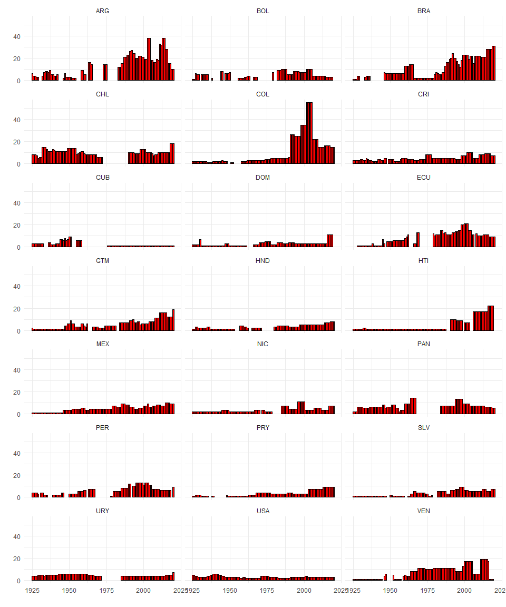

<!-- README.md is generated from README.Rmd. Please edit that file -->

### **partiesAL**: Legislative Parties of the Americas 1925 - 2019

*Aníbal Pérez-Liñán, Nicolás Schmidt, Daniela Vairo*

<!-- badges: start -->

[](https://github.com/Nicolas-Schmidt/partiesAL)
[](https://www.repostatus.org/#active)

<!-- badges: end -->

## Description

This package provides two related datasets. The first one, called
**`parties`**, is a dataset where the unit of analysis is the political
party in each year in the congress for 21 countries of the Americas (20
Latin American countries plus the United States) in the period from 1925
to 2019. The second dataset (**`parties2`**) is an aggregation of this
data, compiled into a unit that becomes country-year. This second
database provides an additional set of systemic variables such as the
effective number of parties in each chamber of the congress.

The countries included in the database are:

``` r
unique(partiesAL::parties$ccode)
#>  [1] "ARG" "BOL" "BRA" "CHL" "COL" "CRI" "CUB" "DOM" "ECU" "GTM" "HND" "HTI"
#> [13] "MEX" "NIC" "PAN" "PER" "PRY" "SLV" "URY" "VEN" "USA"
```

- There are two ways to access the data. One option is to install this R
  package (`partiesAL`) by following the detailed instructions below for
  a conventional installation from a repository. The second option, for
  users who prefer to access the data outside of R, provides three
  available choices:
  [**csv**](https://github.com/Nicolas-Schmidt/partiesAL/tree/master/man/figures/export/csv),
  [**xlsx**](https://github.com/Nicolas-Schmidt/partiesAL/tree/master/man/figures/export/xlsx),
  [**dta**](https://github.com/Nicolas-Schmidt/partiesAL/tree/master/man/figures/export/dta).

- The codebook for the databases can be accessed through this
  [**link**](https://github.com/Nicolas-Schmidt/partiesAL/tree/master/man/figures).

## `parties` and `parties2`

The structure of the databases is as follows

``` r
str(partiesAL::parties)
#> tibble [11,822 × 22] (S3: tbl_df/tbl/data.frame)
#>  $ cowcode  : num [1:11822] 160 160 160 160 160 160 160 160 160 160 ...
#>  $ ccode    : chr [1:11822] "ARG" "ARG" "ARG" "ARG" ...
#>  $ year     : num [1:11822] 1925 1925 1925 1925 1925 ...
#>  $ legis    : num [1:11822] 1 1 1 1 1 1 1 1 1 1 ...
#>  $ date_low : POSIXct[1:11822], format: "1924-03-02" "1924-03-02" ...
#>  $ date_upp : POSIXct[1:11822], format: "1925-03-01" "1925-03-01" ...
#>  $ pty_acrn : chr [1:11822] "UCR" "CONS" "UCR" "PS" ...
#>  $ pty_name : chr [1:11822] "Unión Cívica Radical" "Conservative" "Unión Cívica Radical" "Socialista" ...
#>  $ pty_code : num [1:11822] 1.60e+08 1.60e+08 1.60e+08 1.60e+08 1.61e+08 ...
#>  $ fac_name : chr [1:11822] "Radical Antipersonalista" NA "Radical Yrigoyenist" "Socialist" ...
#>  $ fac_code : chr [1:11822] "160189001001" NA "160189001002" "160189601002" ...
#>  $ s_low    : num [1:11822] 3 14 72 18 17 14 15 31 40 55 ...
#>  $ ts_low   : num [1:11822] 158 158 158 158 158 158 158 158 158 158 ...
#>  $ s_upp    : num [1:11822] 13 8 4 2 0 0 0 13 8 4 ...
#>  $ ts_upp   : num [1:11822] 30 30 30 30 30 30 30 30 30 30 ...
#>  $ presp    : num [1:11822] 1 0 0 0 0 0 0 1 0 0 ...
#>  $ cl_other : num [1:11822] 1 0 0 0 1 0 0 1 0 0 ...
#>  $ cl_altman: num [1:11822] NA NA NA NA NA NA NA NA NA NA ...
#>  $ cl_deheza: num [1:11822] NA NA NA NA NA NA NA NA NA NA ...
#>  $ cl_dpi   : num [1:11822] NA NA NA NA NA NA NA NA NA NA ...
#>  $ founded  : num [1:11822] 1890 1874 1890 1896 8888 ...
#>  $ source   : chr [1:11822] "PHW 1928, p.3/(Gibson 1996, 40)" "PHW 1928, p.3/(Gibson 1996, 40)" "PHW 1928, p.3/(Gibson 1996, 40)" "PHW 1928, p.3/(Gibson 1996, 40)" ...
```

``` r
str(partiesAL::parties2)
#> 'data.frame':    2012 obs. of  17 variables:
#>  $ cowcode  : num  160 160 160 160 160 160 160 160 160 160 ...
#>  $ ccode    : chr  "ARG" "ARG" "ARG" "ARG" ...
#>  $ year     : num  1925 1926 1927 1928 1929 ...
#>  $ legis    : num  1 1 1 1 1 1 0 1 1 1 ...
#>  $ newleg   : num  1 1 0 1 0 1 0 1 0 1 ...
#>  $ date_h   : POSIXct, format: "1924-03-02" "1926-03-07" ...
#>  $ year_h   : num  1924 1926 1926 1928 1928 ...
#>  $ month_h  : num  3 3 3 4 4 4 NA 11 11 3 ...
#>  $ date_s   : POSIXct, format: "1925-03-01" "1925-03-01" ...
#>  $ p_h      : num  0.0196 0.2095 0.2095 0.5613 0.5613 ...
#>  $ p_s      : num  0.481 0.481 0.481 0.269 0.269 ...
#>  $ g_h      : num  0.131 0.209 0.209 0.561 0.561 ...
#>  $ g_s      : num  0.481 0.481 0.481 0.269 0.269 ...
#>  $ coalition: num  1 0 0 0 0 0 NA 1 1 1 ...
#>  $ enph     : num  3.41 2.34 2.34 1.75 1.75 ...
#>  $ enps     : num  2.04 2.04 2.04 1.91 1.91 ...
#>  $ c_h      : num  0.796 0.931 0.931 0.608 0.608 ...
```

## Installation

To install the development version from GitHub:

``` r
if (!require("remotes")) install.packages("remotes")
remotes::install_github("Nicolas-Schmidt/partiesAL")
```

## Example

In the following example, the `parties` database is used to visualize
the temporal evolution of the number of political parties in the
congresses of each country.

``` r
library(partiesAL)

nparty <- 
    partiesAL::parties %>% 
    select(ccode, pty_code, year, legis) %>% 
    filter(legis %in% c(1,3)) %>% 
    distinct() %>%
    select(-pty_code, - legis) %>% 
    split(., .$ccode) %>% 
    lapply(., table) %>% 
    lapply(., as.data.frame) %>% 
    do.call('rbind', .) 


ggplot(nparty, aes(x = as.numeric(as.character(year)), y = Freq))+
    geom_bar(stat="identity", width = NULL, fill = "red", color = "black")+ 
    facet_wrap(~ccode, ncol = 3) + 
    theme_minimal() +
    labs(x = "", y = "")
```


